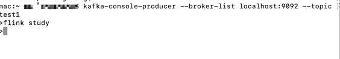
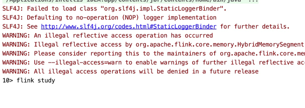
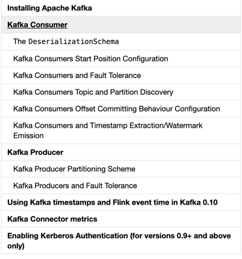

#### 参考文档：https://ci.apache.org/projects/flink/flink-docs-release-1.6/dev/connectors/filesystem_sink.html

##1. kafka connector
flink提供了特殊的kafka连接器，用于从kafka主题读写数据。

flink-kafka使用者与flink的检查点机制集成，以提供精确的一次处理语义。

为了实现这一点，Flink并不完全依赖于Kafka的消费者群体偏移量跟踪，而是在内部跟踪和检查这些偏移量。

####1.1 添加maven
```
<dependency>
  <groupId>org.apache.flink</groupId>
  <artifactId>flink-connector-kafka-0.8_2.11</artifactId>
  <version>1.6.1</version>
</dependency>

```
#### 1.2 安装kafka
请自行百度

#### 1.3 运行代码
运行kafkaConsumerConnector，同时producer发送消息（kafka-console-producer --broker-list localhost:9092 --topic test1
），效果图如下
- producer



- consumer



#### 1.4 要点&要点说明
- 这里只是简单的说明了flink如何接收kafka的消息，官网的文档如下




##### 1.4.1 Consumer下的DeserializationSchema指的是反序列化架构，包括：
- TypeInformationSerializationSchema:基于Flink的创建架构,如果数据同时由Flink写入和读取，这将很有用
- JsonDeserializationSchema:将序列化的JSON转换为ObjectNode对象
- AvroDeserializationSchema

##### 1.4.2 Flink作为生产者时的分区方案
- 默认情况下，producer使用flinkfixedpartitioner将每个flink kafka producer parallel子任务映射到单个kafka分区
- 继承FlinkKafkaPartitioner自定义分区类，注意，分区器实现必须是可序列化的，并且由于分区程序不是生产者的检查点状态的一部分，因此分区程序中的任何状态都将在作业失败时丢失
- 提供null作为自定义分区器，kafka通过其附加的密钥对写入的记录进行分区（根据使用提供的序列化模式为每个记录确定）

#### 1.4.3 kafka容错
使用：启用Flink的检查点后+配置setLogFailuresOnly(boolean)+配置setFlushOnCheckpoint(boolean)
 - setLogFailuresOnly(boolean)：默认情况下，设置为false。启用此选项将使生产者只记录失败，而不是捕获并重新触发它们。这基本上说明了记录是成功的，即使它从未写到目标卡夫卡主题。必须至少禁用一次。
 - setflushoncheckpoint(boolean)：默认情况下，设置为true。启用此选项后，Flink的检查点将等待检查点时的任何动态记录被Kafka确认，然后才能继续检查点。这可以确保检查点之前的所有记录都已写入卡夫卡。必须至少启用一次。
 
 注意:默认情况下，重试次数设置为“0”。这意味着，setLogFailuresOnly=false，生产者会在错误（包括leader变更）时立即失败。默认情况下，该值设置为“0”，以避免目标主题中由重试引起的重复消息。对于大多数频繁更改代理的生产环境，我们建议将重试次数设置为更高的值。
 
##2.hdfs connector
####2.1 添加maven
```
<dependency>
  <groupId>org.apache.flink</groupId>
  <artifactId>flink-connector-filesystem_2.11</artifactId>
  <version>1.6.1</version>
</dependency>
```
####2.2 运行代码


##3 说明：
- 1.flink connectors指的是Streaming connectors

- 2.该版本为1.6版本，flink已经发布了1.9版本。
